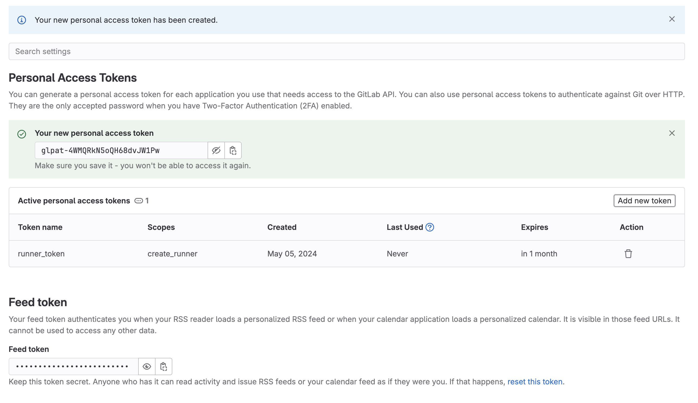
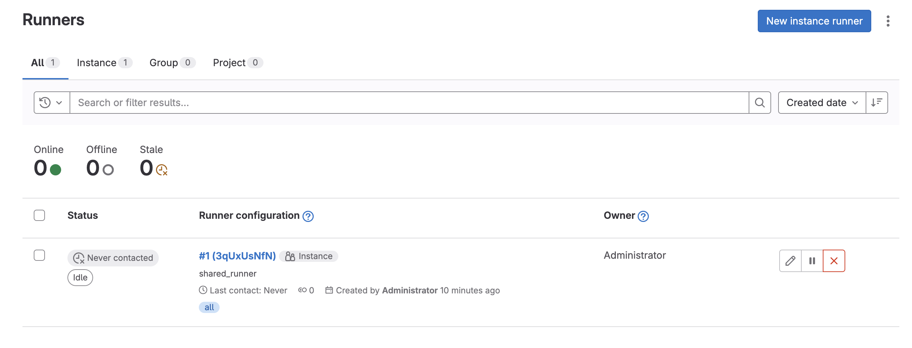
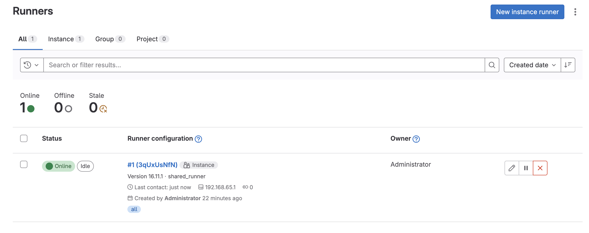

# GitLab-CI Installation (WIP)

## Prerequisites

- Docker to run GitLab-CI

- A Kubernetes cluster to deploy GitLab-CI runners on
- Helm to install GitLab-CI runners

## Install GitLab-CI

To start the Docker container with GitLab-CI, run the following command:

```bash
source ./shell/gitlab.sh
gitlab.start
```

After the container is started, you can access GitLab-CI at http://gitlab.scalastic.local:4000.

## Install GitLab-CI Runner

### Create a Personal Access Token

1. To create a personal access token, go to your GitLab profile and click on the "Access Token" tab.
2. Under "Personal Access Token", click on "Add new token":

- Give the token a name, for example "runner-token".
- Select an "Expiration date".
- Select the "create_runner" scope.
- Click on "Create personal access token".

Copy the token (this is your Personal Acces Token) and save it in a safe place. It should start with `glpat-` and contain a long string of letters and numbers.



### Create a GitLab-CI Runner

```bash
source ./shell/gitlab.sh
gitlab.create_runner <YOUR_PERSONAL_ACCESS_TOKEN>
```

You should see the following output:

```json
{"id":1,"token":"glrt-3qUxUsNfNcwz39CxQU3z","token_expires_at":null}
```

Copy the token (this is your Runner Token) and save it in a safe place. It should start with `glrt-` and contain a long string of letters and numbers.

### Check Runner Registration

Go to your GitLab "Admin Area" and click on the "Runners" tab.

You should now see your runner listed as "Never contacted":




### Deploy GitLab-CI Runner on Kubernetes

```bash
gitlab.configure_kubernetes_for_runner gitlab
gitlab.configure_helm gitlab <YOUR_RUNNER_TOKEN>
```

Refresh the Runners Instances page in GitLab. You should see your new Runner online and ready to use:



----
> THE LINES BELOW ARE FOR DEVELOPMENT PURPOSES ONLY
>
> THEY SHOULD BE DELETED AFTER REVIEWING
----

## Deploy GitLab-CI with Helm

```bash
helm install gitlab gitlab/gitlab --set global.edition=ce --set global.hosts.domain=scalastic.local --set certmanager.install=false
```

Get the Jenkins admin password:

```bash
kubectl get secret jenkins -o jsonpath="{.data.jenkins-admin-password}" | base64 --decode; echo
```

## Configure Ingress to access Jenkins

- Install Nginx Ingress Controller:

```bash
helm repo add ingress-nginx https://kubernetes.github.io/ingress-nginx
helm repo update
helm install nginx-ingress ingress-nginx/ingress-nginx
```

- Create a `jenkins-ingress.yaml` file:

```yaml
apiVersion: networking.k8s.io/v1
kind: Ingress
metadata:
  name: jenkins-ingress
  annotations:
    kubernetes.io/ingress.class: "nginx"
spec:
  rules:
  - host: jenkins.scalastic.local
    http:
      paths:
      - path: /
        pathType: Prefix
        backend:
          service:
            name: jenkins
            port:
              number: 8080
```

- Apply the configuration:

```bash
kubectl apply -f jenkins-ingress.yaml
```
